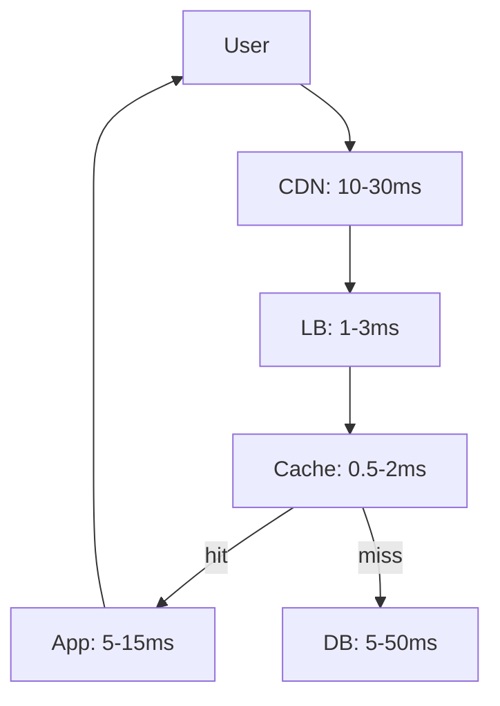

# Foundations — Latency, Throughput, Availability

## Latency Breakdown (Real Numbers)
**Network:** LAN 0.1ms, WAN 50-150ms, Cross-continent 200ms+  
**Database:** Index lookup 1ms, Full scan 100ms+, Join 10-100ms  
**Cache:** In-memory 0.1ms, Redis 1ms, Memcached 0.5ms  
**Disk:** SSD 0.1ms, HDD 10ms, Network storage 1-5ms  
**L_total = Σ component_i + network + queueing_delay**

## Throughput Engineering
**Little's Law:** N = λ × L (users = arrival_rate × response_time)  
**Utilization target:** ρ < 0.7 for stable performance, ρ < 0.5 for burst capacity  
**Queue theory:** Response time explodes as ρ → 1.0  
**Bottleneck identification:** Throughput = min(component_throughputs)

## Availability Math
**SLA targets:** 99% = 3.65 days/year, 99.9% = 8.76 hours/year, 99.99% = 52.6 min/year  
**Redundancy:** A_system = 1 - (1-A_component)^N for N independent components  
**Dependency chains:** A_chain = A1 × A2 × ... × An (multiplicative)  
**Error budgets:** Remaining downtime = SLA_target - actual_downtime

## CAP Theorem in Practice
**Partition tolerance:** Always required in distributed systems  
**CP systems:** RDBMS, etcd, Consul (sacrifice availability during partitions)  
**AP systems:** DynamoDB, Cassandra, DNS (sacrifice consistency during partitions)  
**Consistency spectrum:** Strong → Bounded staleness → Session → Eventual

## Quorum Mathematics
**Strong consistency:** R + W > N (read + write quorums overlap)  
**High availability:** R + W ≤ N (can tolerate failures)  
**Common configs:** N=3, R=2, W=2 (strong) vs N=3, R=1, W=1 (fast)  
**Latency impact:** Quorum latency = P(N-R+1) percentile of replica latencies
