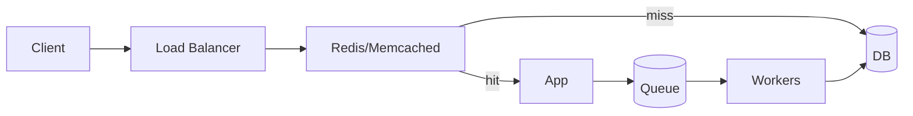

# Caching, Load Balancing, Queues

## Equations to anchor
- **Cache hit ratio (η):** E[L]=ηL1+(1-η)L2; maximize η given memory.
- **LB:** consistent hashing to minimize remaps on scale-out.
- **Queues:** M/M/1: W=ρ/(μ-λ). Keep ρ<1; add backpressure or rate limits if λ>μ.

## How to talk about it
- “We measured hotset as top 20% keys; with η=0.9 we cut DB traffic by 10x. At $JOB we also capped TTL to avoid serving cold data after deploys.”
- “For load balancing I default to L4 round-robin; when node churn is high, switch to consistent hashing to avoid 30% cache churn.”
- “Queues absorb spikes; I size workers so ρ stays under 0.7, and enforce dead-letter with idempotent consumers so retries don’t double-charge.”

## Failure modes to mention
- Cache stampede: add jittered TTL and request coalescing.
- Load balancer hot keys: consistent hashing + virtual nodes to smooth distribution.
- Queue backlog: backpressure to clients, drop non-critical classes, alert on age not just depth.

