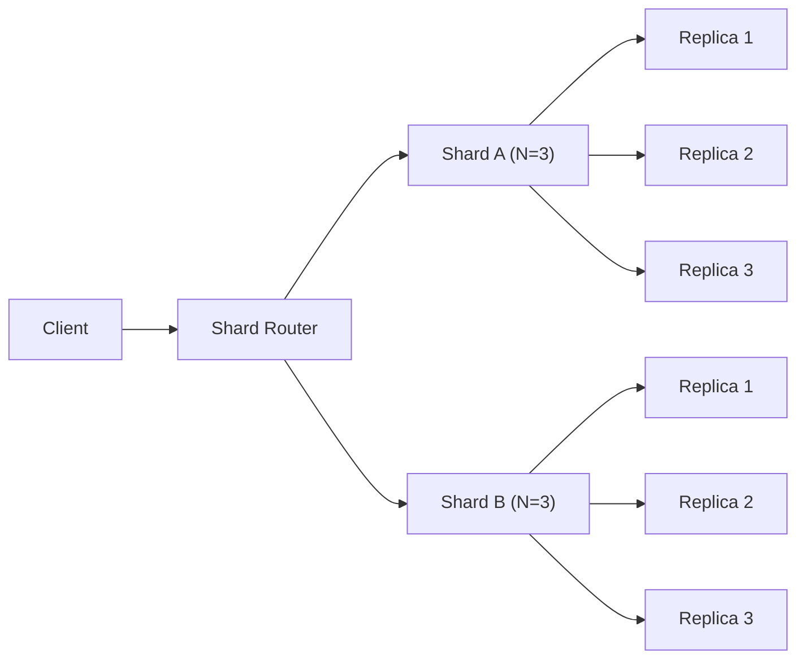

# Sharding, Replication, Quorums

## Core math
- Shard function: s(k)=hash(k) mod n; keep load balance near uniform.
- Replication to increase availability; independence assumption gives A=1-p^N.
- Quorums: R+W>N ensures intersection, hence strong consistency.

## Interview narration
- “We stayed single-shard until CPU >70% and p99 > 150ms; then we hash(user_id) with 128 virtual nodes to avoid hotspots.”
- “Replicas give 1-(1-a)^N availability; we ran 3 AZ replicas which pushed single-node 99.5% to 99.999% cluster availability.”
- “For N=3 we used R=1,W=2 on reads-heavy paths; for money movement we flip to R=2,W=2 to keep strong consistency under failure.”

## Gotchas
- Rebalancing causes thundering herds if caches are keyed by physical shard; use indirection/consistent hashing ring.
- Cross-shard joins are expensive: denormalize or move to search index.
- Split-brain risk: require quorum ACKs and a fencing token on leader election.

