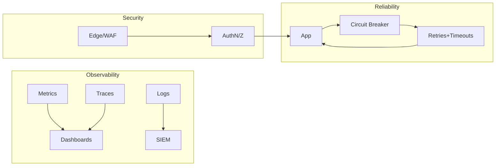

# Observability, Reliability, Security

## What to instrument
- **Metrics/Traces/Logs:** define P50/P95/P99, error budgets, dashboards; sample traces (1-5%), log to cold storage.
- Golden signals: latency, traffic, errors, saturation. Alert on SLO burn, not just thresholds.

## Reliability moves
- Circuit breakers + retries with jitter; timeouts per hop; bulkheads for noisy neighbors.
- Regional isolation tests monthly; chaos drills on caches/DB/network to prove failover paths.

## Security stance
- AuthN/AuthZ everywhere, TLS in transit, KMS-backed at rest, key rotation.
- Principle of least privilege for services; WAF + rate limits on public edges.
- “At $JOB we cut auth latency by 20ms by moving JWT validation to the edge; we still centralized policy in OPA.”

