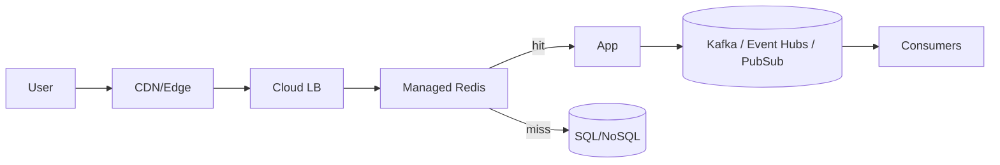

# Cloud Mapping (AWS / Azure / GCP)

| Function | AWS | Azure | GCP |
|---|---|---|---|
| LB | ALB/NLB | App Gateway/Front Door | Cloud LB |
| Compute | EC2/ECS/EKS | VMSS/AKS | GCE/GKE |
| Cache | ElastiCache | Azure Cache for Redis | Memorystore |
| Queue/Stream | SQS/MSK | Service Bus/Event Hubs | Pub/Sub |
| Object Store | S3 | Blob | Cloud Storage |
| NoSQL | DynamoDB | Cosmos DB | Firestore |
| SQL | RDS/Aurora | Azure SQL DB | Cloud SQL |

## How to choose in the room
- Latency classes: CDN/edge (<50ms), managed cache (1-2ms), managed DB (5-20ms), cross-region (70-150ms). Keep user-path under 200ms P95.
- Cost cues: object storage ~$0.02/GB-mo, cache memory ~$0.03-0.05/GB-hr, cross-region egress ~$0.12/GB. Mention when egress dominates.
- Default stacks:  
  - Read-heavy + simple access → Cloud LB + CDN + Redis + Dynamo/Cosmos/Firestore.  
  - SQL with HA → RDS/Aurora, AZ multi-AZ, read replicas; failover tested quarterly.  
  - Streaming → MSK/Event Hubs/Pub/Sub with compacted topics for idempotent consumers.
- Vendor quirks: DynamoDB autoscaling lag (pre-provision for spikes), Azure Cosmos RU budgeting, GCP per-project quota ceilings. State the mitigations you’d apply.

