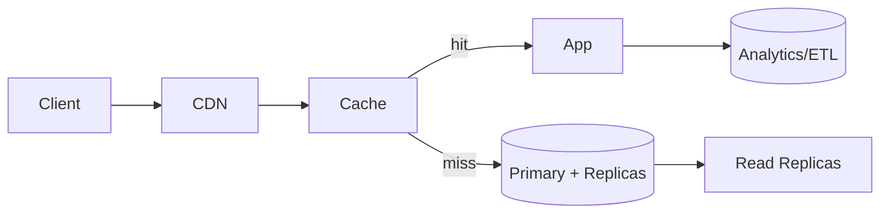

# Case Studies — With Real Numbers

## 1) URL Shortener (bit.ly scale)
**Scale:** 100M URLs/day, 10:1 read:write ratio  
**QPS:** Write: 1,157/s, Read: 11,570/s  
**Storage:** 100M × (7 bytes key + 100 bytes URL) = 10.7GB/day = 3.9TB/year  
**Cache:** Target η=0.9 hit ratio → 90% of 11,570 = 10,413 req/s from cache  
**Memory needed:** Hot URLs (20% of total) × 107 bytes ≈ 2.1GB cache (round to 4GB incl. overhead)  
**Database:** Read replicas = ceil(1,157 / 1000) = 2 replicas minimum



## 2) WhatsApp-like Messaging (1B users)
**Scale:** 1B users, 50 messages/user/day = 50B messages/day  
**QPS:** 50B / 86400 = 578K messages/sec peak  
**Storage:** 50B × 1KB avg = 50TB/day = 18PB/year  
**Delivery:** 99.9% within 100ms, 99.99% within 1s  
**Partitioning:** Hash(user_id) mod 1000 shards  
**Replication:** 3x for availability, async cross-region

## 3) YouTube-lite (100M hours watched/day)
**Upload:** 500 hours/min = 30K videos/hour  
**Storage:** 30K × 1GB avg = 30TB/hour raw, 150TB/hour transcoded  
**Transcoding:** 5 formats × 2x realtime = 10x compute cost  
**CDN:** 100M hours × 1Mbps avg ≈ 4.2Tbps sustained global bandwidth  
**Cost breakdown:** Storage $2M/month, Compute $500K/month, CDN $3M/month

## 4) Stripe-like Payments (10M transactions/day)
**QPS:** 10M / 86400 = 116 TPS average, 500 TPS peak  
**Latency:** P95 < 200ms, P99 < 500ms  
**Consistency:** Strong for money movement, eventual for analytics  
**Idempotency:** 24-hour key retention, SHA-256 hash  
**Compliance:** PCI DSS Level 1, SOX controls, audit trails  
**Fraud detection:** <50ms ML inference, 0.1% false positive rate

#### Code Example: Idempotency Key Generation
```python
import hashlib
import json

def generate_idempotency_key(payload: dict) -> str:
    """
    Creates a stable idempotency key from a request payload.
    """
    # Use a canonical representation of the payload (sorted keys)
    payload_str = json.dumps(payload, sort_keys=True)
    return hashlib.sha256(payload_str.encode('utf-8')).hexdigest()

# Example for a payment request
payment_request = {"amount": 1000, "currency": "usd", "user_id": "user_123"}
idempotency_key = generate_idempotency_key(payment_request)
# The client would send this key in the 'Idempotency-Key' header.
```

## 5) Global Booking (Airbnb scale)
**Inventory:** 7M listings, 150M users, 500M searches/day  
**Search QPS:** 500M / 86400 = 5,787/s average, 20K/s peak  
**Geo-sharding:** 50 regions, route by user location  
**Consistency:** Eventual for search, strong for booking  
**Cache layers:** L1 (CDN) → L2 (Redis) → L3 (Elasticsearch) → DB  
**SLA:** 99.95% availability, <100ms search latency P95
