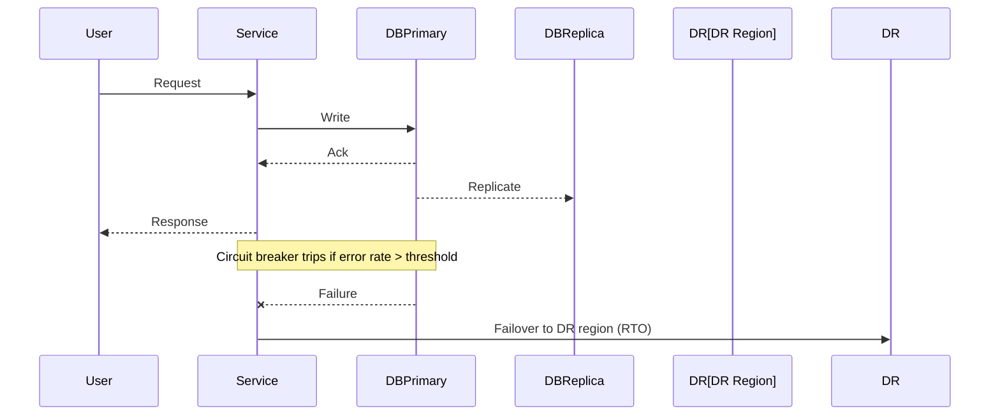

# Failure Engineering — Chaos, Incidents, Capacity

## Circuit Breaker Math
**Failure threshold:** F_threshold = error_rate × time_window  
**Recovery condition:** success_rate > 0.8 for 30s  
**Exponential backoff:** delay = base_delay × 2^attempt (max 60s)

```
State transitions:
CLOSED → OPEN: failures > threshold
OPEN → HALF_OPEN: timeout expires  
HALF_OPEN → CLOSED: success_rate > 0.8
```

## Capacity Planning Formulas
**Little's Law:** N = λ × L (concurrent users = arrival_rate × latency)  
**Utilization target:** ρ = 0.7 (70% max for stable performance)  
**Scaling trigger:** CPU > 70% OR memory > 80% OR queue_depth > 100

## Real Incident Patterns
**Database cascade failure:** Connection pool exhaustion → app timeouts → user retry storm  
**Cache stampede:** Popular key expires → N requests hit DB → DB overload  
**Thundering herd:** Service restart → all clients reconnect simultaneously

## SLA Math
**Availability budget:** 99.9% = 8.76h downtime/year = 43.8min/month  
**Error budget burn rate:** current_error_rate / sla_error_rate  
**MTTR target:** < 15min for P0, < 2h for P1, < 24h for P2

## Disaster Recovery
**RTO calculation:** detection_time + failover_time + validation_time  
**RPO constraint:** max_data_loss = backup_frequency + replication_lag  
**Cross-region latency:** US-East to US-West = 70ms, US to EU = 150ms


