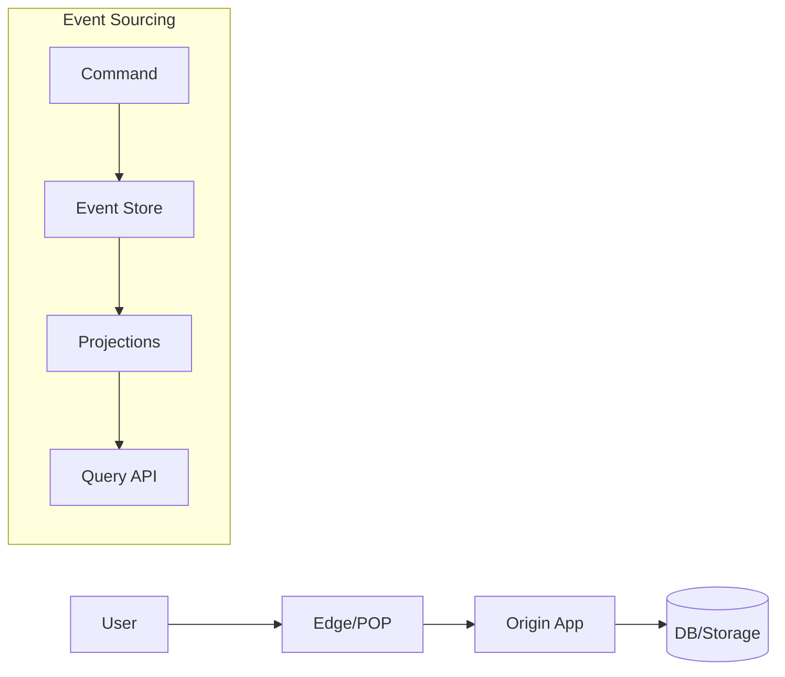

# Modern Architecture Patterns

## Event Sourcing + CQRS
**Event store size:** events_per_day × avg_event_size × retention_days  
**Projection lag:** acceptable_staleness < 100ms for real-time, < 5s for analytics  
**Snapshot frequency:** every 1000 events OR daily, whichever is smaller

```
Command: UserRegistered → Event Store → Projection Updates
Query: Read from optimized projections, not event stream
```

**Narration:** “We used event sourcing when auditability mattered; projections let us serve sub-10ms reads while writes stayed append-only. Operationally, snapshots kept cold replays under 5 minutes.”

## Service Mesh Economics
**Sidecar overhead:** +20ms latency, +50MB memory per service  
**mTLS cost:** +5-10ms per hop, +15% CPU for encryption  
**Observability tax:** +2-5% CPU for tracing, +10MB memory for metrics

**Narration:** “Mesh only paid off once we had 20+ services and multi-team ownership. Before that, the sidecar tax was wasted.”

## Serverless Patterns
**Cold start penalty:** 100-500ms for JVM, 10-50ms for Node.js, 1-5ms for Go  
**Concurrent execution limit:** 1000 default (AWS), scale to 10K+ with limits increase  
**Cost crossover:** serverless cheaper below 30% utilization, containers cheaper above

**Narration:** “We kept cron/ETL on Lambda; user-facing APIs moved to containers to dodge cold starts and get predictable latency.”

## Data Mesh Principles
**Domain ownership:** Each team owns their data products end-to-end  
**Federated governance:** Common standards, local implementation  
**Self-serve platform:** Data infrastructure as a service, not shared databases

**Narration:** “We enforced contracts via schemas + quality SLAs; consumers could veto changes that broke them.”

## Edge Computing Math
**CDN cache hit:** 85-95% typical, 99%+ for static assets  
**Edge latency:** <50ms to 90% of users globally  
**Bandwidth savings:** 80-90% reduction in origin traffic with proper caching

**Narration:** “Edge worked when payloads were cacheable or could be precomputed; dynamic personalization still hit origin with feature-flagged rollouts.”


